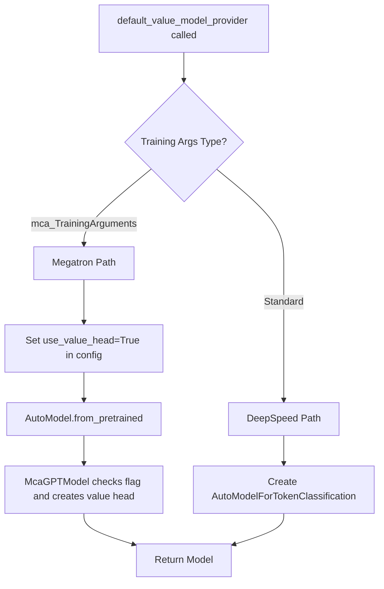

# Critic Model Megatron Backend Design

## 1. High-Level Design of Implementation

### Overview
Add Megatron backend support for critic models alongside the existing DeepSpeed backend, following the actor_train dual-backend pattern. This enables critics to leverage Megatron's model parallelism (tensor, pipeline, context, and expert parallel) for large-scale training.

### Core Requirements
Both backends must provide identical functionality:
- **Input**: Same data batches from the pipeline
- **Output**: Tensor shape `[batch_size, seq_len, 1]` to `forward_func_values`
- **Processing**: `forward_func_values` does `output[:, :-1].squeeze(-1)` → `[batch, seq_len-1]`
- **Loss**: Identical MSE loss computation for value function training

### Backend Comparison

| Aspect | DeepSpeed (Current) | Megatron (To Add) |
|--------|---------------------|-------------------|
| Model Types | AutoModelForTokenClassification, TRL ValueHead | McaGPTModel with use_value_head=True |
| Output Format | TokenClassifierOutput(logits=[B,S,1]) | Raw tensor [B,S,1] |
| Parallelism | ZeRO stages, CPU offloading | TP, PP, CP, EP, Virtual PP |
| Checkpoint Format | HuggingFace native | Megatron with HF compatibility |
| Optimizer | DeepSpeed ZeRO optimizer | Megatron distributed optimizer |

## 2. New Concepts, Entities and Architectures

### 2.1 Configuration-Based Value Head
Instead of creating a separate McaValueModel class, we add a configuration flag to enable value head functionality in any Megatron model.

**Key Design Decision:**
- Add `use_value_head: bool = False` to McaModelConfig
- McaGPTModel (and all its subclasses) check this flag during initialization
- When enabled, replaces language modeling head with value head
- Works automatically for all model variants (Qwen2VL, DeepSeekV3, etc.)

### 2.2 Architecture: Value Head Integration
Replace the language modeling head with a value head that projects hidden states to scalar values.

**Implementation Approach:**
1. Parent GPTModel creates standard output_layer during initialization
2. If `use_value_head=True`, we replace it with our value head
3. The original output_layer is garbage collected (temporary memory overhead is acceptable)
4. ValueHeadWrapper provides compatibility with parent class expectations

**Key Architectural Points:**
1. **Simple replacement**: Let parent create output_layer, then replace it
2. **ValueHeadWrapper**: Adapts value head to output_layer interface with weight property
3. **Pipeline parallel awareness**: Only last stage has value head
4. **No subclassing needed**: All model variants inherit this behavior
5. **Memory consideration**: Temporary ~234MB-1.2GB allocation is acceptable for design simplicity

## 3. New Workflow Logic

### 3.1 Model Creation Workflow



### 3.2 Forward Pass Workflow Comparison

**DeepSpeed Workflow:**
```
1. model(input_ids, attention_mask, ...) → TokenClassifierOutput
2. forward_func(data, output.logits) → Direct processing
3. forward_func_values receives [B,S,1] tensor
4. Process to [B,S-1] and return
```

**Megatron Workflow:**
```
1. model(input_ids, attention_mask, ...) → Raw tensor [B,S,1]
2. inner_forward_step returns (output_tensor, partial(loss_func, data))
3. forward_backward_func extracts tensor, calls loss_func
4. forward_func_values receives [B,S,1] tensor
5. Process to [B,S-1] and return
```

### 3.3 Checkpoint Save/Load Workflow

**Save Workflow:**
1. CriticWorker.do_checkpoint() called
2. Strategy.save_checkpoint() invoked
3. For Megatron: Model saves all weights including value head
4. Save via save_pretrained() for HF compatibility

**Load Workflow:**
1. resume_from_checkpoint specified
2. Strategy.load_checkpoint() called
3. Model loads state dict
4. Missing value_head weights are acceptable (randomly initialized)

## 4. New Data Structures and Internal Components

### 4.1 McaModelConfig Addition
```python
@dataclass
class McaModelConfig(PretrainedConfig):
    # ... existing fields ...
    
    use_value_head: bool = field(
        default=False,
        metadata={"help": "Replace language modeling head with value head for critic training"}
    )
```

### 4.2 Value Head Weight Structure
```python
# Weight tensor shape
value_head.weight: torch.Tensor[hidden_size, 1]  # No bias by default

# In state dict (when use_value_head=True)
state_dict['output_layer.value_head.weight'] = tensor[hidden_size, 1]
```

### 4.3 Configuration Structure
```yaml
critic:
  model_args:
    dtype: bf16
    # use_value_head will be set programmatically
  strategy_args:
    strategy_name: megatron_train
    strategy_config:
      tensor_model_parallel_size: 1
      pipeline_model_parallel_size: 1
      expert_model_parallel_size: 1
      use_distributed_optimizer: true
      recompute_granularity: full
```

## 5. Function Interface Signatures and Core Logic

### 5.1 ValueHeadWrapper Class

```python
class ValueHeadWrapper(torch.nn.Module):
    """Wrapper to adapt value_head to output_layer interface.
    
    The parent GPTModel.forward() expects output_layer to be callable with:
    logits, bias = self.output_layer(hidden_states, weight=..., runtime_gather_output=...)
    
    This wrapper ignores the extra parameters and returns the expected tuple format.
    It also exposes a weight property for compatibility with setup_embeddings_and_output_layer.
    """
    
    def __init__(self, value_head):
        super().__init__()
        self.value_head = value_head
    
    @property
    def weight(self):
        """Expose weight for compatibility with setup_embeddings_and_output_layer.
        
        The parent class's setup_embeddings_and_output_layer() method expects
        self.output_layer.weight to exist and sets attributes on it.
        """
        return self.value_head.weight
    
    def forward(self, hidden_states, weight=None, runtime_gather_output=None):
        """Forward pass matching output_layer interface.
        
        Args:
            hidden_states: Hidden states from transformer [batch, seq_len, hidden_size]
            weight: Optional weight for embedding sharing (ignored for value model)
            runtime_gather_output: Optional flag for parallel output (ignored for value model)
            
        Returns:
            Tuple of (values, None) where values has shape [batch, seq_len, 1]
        """
        values = self.value_head(hidden_states)
        return values, None  # Return (logits, bias) tuple format
```

### 5.2 McaGPTModel Modification

```python
class McaGPTModel(GPTModel, PretrainedModel):
    """Base Megatron GPT model with optional value head support."""
    
    def __init__(self, config: "McaModelConfig", **kwargs):
        transformer_layer_spec = self._get_transformer_layer_spec(config)
        pre_process = kwargs.pop("pre_process", mpu.is_pipeline_first_stage())
        post_process = kwargs.pop("post_process", mpu.is_pipeline_last_stage())
        
        # Initialize parent GPT model
        super().__init__(
            config=config,
            transformer_layer_spec=transformer_layer_spec,
            vocab_size=config.padded_vocab_size,
            max_sequence_length=config.max_sequence_length,
            pre_process=pre_process,
            post_process=post_process,
            parallel_output=True,
            share_embeddings_and_output_weights=config.tie_embeddings_and_output_weights,
            position_embedding_type=config.position_embedding_type,
            rotary_percent=config.rotary_percent,
            rotary_base=config.rotary_base,
            mtp_block_spec=kwargs.get("mtp_block_spec", None),
        )
        
        # Replace output layer with value head if configured for critic training
        # Note: The parent class creates a large output_layer when post_process=True.
        # We replace it here, and the old one will be garbage collected (~234MB-1.2GB).
        # This temporary memory usage is acceptable for the simplicity of the design.
        if getattr(config, 'use_value_head', False) and self.post_process:
            # Validate configuration
            if self.share_embeddings_and_output_weights:
                raise ValueError(
                    "Cannot use value_head with share_embeddings_and_output_weights=True. "
                    "Value head is incompatible with weight sharing."
                )
            
            # Create value head: hidden_size → 1
            value_head = torch.nn.Linear(
                config.hidden_size, 1, bias=False, dtype=config.params_dtype
            )
            
            # Initialize value head weights
            if config.perform_initialization:
                config.init_method(value_head.weight)
            
            # Set tensor parallel attributes
            tensor_parallel.set_defaults_if_not_set_tensor_model_parallel_attributes(
                value_head.weight
            )
            
            # Replace output_layer with value head wrapper
            self.output_layer = ValueHeadWrapper(value_head)
        
        # Rest of initialization...
        for param in self.parameters():
            tensor_parallel.set_defaults_if_not_set_tensor_model_parallel_attributes(param)
        if not config.use_cpu_initialization:
            self.cuda(torch.cuda.current_device())
```

### 5.3 Model Provider Update

```python
def default_value_model_provider(
    tokenizer: PreTrainedTokenizer,
    model_args: ModelArguments,
    training_args: TrainingArguments = None,
    is_trainable: bool = False
) -> Union[AutoModel, VirtualModels]:
    """
    Create value model for critic training.
    
    Supports both DeepSpeed (HuggingFace models) and Megatron backends.
    For Megatron, sets use_value_head=True in config to enable value head.
    
    Args:
        tokenizer: Tokenizer for the model
        model_args: Model configuration arguments
        training_args: Training configuration (determines backend)
        is_trainable: Whether model will be trained
        
    Returns:
        Model configured for value prediction (critic)
    """
    
    old_model_name_or_path = model_args.model_name_or_path
    model_args.model_name_or_path = download_model(model_args.model_name_or_path)
    prepare_automap_files(model_args.model_name_or_path)
    
    if isinstance(training_args, mca_TrainingArguments):
        # Megatron backend for value model
        from mcore_adapter.models.auto.modeling_auto import AutoModel
        
        # Enable value head in config
        if training_args.additional_configs is None:
            training_args.additional_configs = {}
        training_args.additional_configs['use_value_head'] = True
        
        # Create model with value head
        model = AutoModel.from_pretrained(model_args.model_name_or_path, training_args)
        
        # Set training/eval mode
        if is_trainable:
            model.train()
            for param in model.parameters():
                param.requires_grad = True
        else:
            model.eval()
            for param in model.parameters():
                param.requires_grad = False
        
        # Apply freezing and patching
        freeze_model(model, model_args)
        config = AutoConfig.from_pretrained(model_args.model_name_or_path)
        patch_model(model, config, use_mcore=True)
        
    else:
        # DeepSpeed backend (existing implementation)
        # ... existing code for AutoModelForTokenClassification or TRL ...
    
    model_args.model_name_or_path = old_model_name_or_path
    return model
```

## 6. Testing Strategy

### 6.1 Functional Validation Tests
```python
# Test 1: Output shape validation
def test_output_shape():
    # Set use_value_head=True in config
    config.use_value_head = True
    model = McaGPTModel(config)
    
    output_tensor = model(input_ids, attention_mask)
    assert output_tensor.shape == (batch_size, seq_len, 1)
    
    values, _ = forward_func_values(data, output_tensor)
    assert values.shape == (batch_size, seq_len - 1)

# Test 2: Backend output consistency
def test_backend_consistency():
    output_deepspeed = critic_deepspeed.compute_values(data)
    output_megatron = critic_megatron.compute_values(data)
    # Allow for numerical differences due to different implementations
    assert torch.allclose(output_deepspeed, output_megatron, rtol=0.05, atol=0.1)
```

### 6.2 Configuration Tests
```python
# Test 3: Value head creation with config flag
def test_value_head_creation():
    config = McaModelConfig.from_pretrained(model_path)
    
    # Without flag - should have normal output layer
    config.use_value_head = False
    model = McaGPTModel(config)
    assert model.output_layer is not None  # Normal LM head
    
    # With flag - should have value head
    config.use_value_head = True
    model = McaGPTModel(config)
    if model.post_process:
        assert isinstance(model.output_layer, ValueHeadWrapper)
        assert model.output_layer.value_head.out_features == 1
```

### 6.3 Model Variant Tests
```python
# Test 4: All model variants support value head
def test_model_variants():
    from mcore_adapter.models.qwen2_vl.modeling_qwen2_vl import Qwen2VLBaseModel
    from mcore_adapter.models.deepseek_v3.modeling_deepseek_v3 import DeepSeekV3Model
    
    for model_cls in [McaGPTModel, Qwen2VLBaseModel, DeepSeekV3Model]:
        config = McaModelConfig(use_value_head=True, ...)
        model = model_cls(config)
        if model.post_process:
            assert isinstance(model.output_layer, ValueHeadWrapper)
```

## 7. Implementation Checklist

- [ ] **Add use_value_head to McaModelConfig**
  - [ ] Add field with default=False
  - [ ] Add metadata documentation
  - [ ] Ensure it's saved/loaded correctly

- [ ] **Modify McaGPTModel.__init__()**
  - [ ] Add check for config.use_value_head
  - [ ] Create ValueHeadWrapper when flag is True
  - [ ] Ensure proper initialization and tensor parallel attributes

- [ ] **Create ValueHeadWrapper class**
  - [ ] Implement forward() matching output_layer interface
  - [ ] Handle all required parameters

- [ ] **Update default_value_model_provider**
  - [ ] Set use_value_head=True via additional_configs
  - [ ] Remove any McaValueModel references
  - [ ] Ensure proper model creation

- [ ] **Test functional parity with DeepSpeed**
  - [ ] Output shape matches exactly [B,S,1]
  - [ ] Checkpoint saving includes value_head weights
  - [ ] Loading from GPT checkpoint handles missing value_head

- [ ] **Test with model variants**
  - [ ] Qwen2VLBaseModel works with value head
  - [ ] DeepSeekV3Model works with value head
  - [ ] Future models automatically support value head

## 8. Minimal Implementation Plan

### Phase 1: Core Implementation (1-2 hours)

#### 1.1 Add Configuration Field
**File**: `/mcore_adapter/src/mcore_adapter/models/model_config.py`
- Add `use_value_head: bool = False` to McaModelConfig class (~line 100)
- Add field documentation

#### 1.2 Create ValueHeadWrapper
**File**: `/mcore_adapter/src/mcore_adapter/models/model_factory.py`
- Add ValueHeadWrapper class before McaGPTModel (~line 280)
- Implement forward() method to match output_layer interface
- **CRITICAL**: Add @property weight that returns self.value_head.weight

#### 1.3 Modify McaGPTModel
**File**: `/mcore_adapter/src/mcore_adapter/models/model_factory.py`
- In `__init__()`, after super().__init__() (~line 311)
- Add conditional check for `getattr(config, 'use_value_head', False) and self.post_process`
- Add validation for share_embeddings_and_output_weights conflict
- Create and assign ValueHeadWrapper to replace existing output_layer

#### 1.4 Update Model Provider
**File**: `/roll/models/model_providers.py` (line 512)
- Set `use_value_head=True` in additional_configs for Megatron backend
- Remove any McaValueModel imports or references

### Phase 2: Testing (1 hour)

#### 2.1 Basic Functional Test
- Create simple test script:
  - Set use_value_head=True
  - Verify model outputs [B,S,1] tensor
  - Check value head is created correctly

#### 2.2 Integration Test with CriticWorker
- Use existing PPO config
- Verify critic training works with new approach
- Check outputs match expected shapes

### Phase 3: Validation (30 minutes)

#### 3.1 Model Variant Test
- Test with at least one variant (e.g., Qwen2VLBaseModel)
- Verify value head works without modifications

#### 3.2 Checkpoint Test
- Save model with value head
- Load and verify weights are preserved

### Success Criteria
✅ Config flag enables value head in any model  
✅ All model variants work without modification  
✅ Outputs match expected [B,S,1] shape  
✅ Functional parity with DeepSpeed backend  
✅ No McaValueModel class needed

### Files to Modify (Minimal)
1. `/mcore_adapter/src/mcore_adapter/models/model_config.py` - Add use_value_head field
2. `/mcore_adapter/src/mcore_adapter/models/model_factory.py` - Add ValueHeadWrapper and modify McaGPTModel
3. `/roll/models/model_providers.py` - Set flag in model provider

## 9. Edge Cases and Error Handling

### 9.1 Checkpoint Compatibility
- **Issue**: Loading from GPT checkpoint missing value_head weights
- **Solution**: This is expected - value head will be randomly initialized
- **Behavior**: Same as DeepSpeed/TRL critics which also randomly initialize

### 9.2 Virtual Pipeline Parallelism
- **Issue**: Multiple model chunks may have post_process=True
- **Solution**: Each chunk independently checks flag and creates value head if needed

### 9.3 Model Variants
- **Issue**: New model types need value head support
- **Solution**: Automatic - all subclasses of McaGPTModel inherit the behavior

### 9.4 Configuration Migration
- **Issue**: Existing configs don't have use_value_head field
- **Solution**: Default is False, so existing configs work unchanged

### 9.5 Weight Sharing Conflict
- **Issue**: share_embeddings_and_output_weights is incompatible with value head
- **Solution**: Explicit validation raises ValueError with clear message

### 9.6 setup_embeddings_and_output_layer Compatibility
- **Issue**: Parent method expects output_layer.weight to exist
- **Solution**: ValueHeadWrapper exposes weight property that returns value_head.weight

### 9.7 Multi-Token Prediction (MTP)
- **Issue**: MTP models also create output_layer when mtp_process=True
- **Solution**: Our replacement logic works regardless - we check post_process flag after parent init

## 10. Performance Considerations

### Memory Footprint
- Value head adds minimal parameters: hidden_size × 1
- No additional activation memory compared to LM head
- Actually saves memory vs full vocabulary projection

### Compute Efficiency
- Single linear projection vs vocabulary projection
- Significant compute reduction compared to full LM head
- Compatible with all optimization techniques

### Parallelism Benefits
- Tensor parallel: Value head weights are replicated (tiny overhead)
- Pipeline parallel: Only last stage computes values
- Context parallel: Automatic sequence splitting works unchanged
- Expert parallel: Compatible with MoE models

## 11. Key Design Advantages

### Simplicity
- **10-15 lines of code** total change
- No new classes or complex inheritance
- Configuration-driven behavior

### Maintainability
- All logic in one place (McaGPTModel.__init__)
- No monkey-patching or external modifications
- Clear, explicit configuration

### Extensibility
- New model variants automatically supported
- Future features can check same flag
- Easy to add more head types if needed

### Consistency
- Follows existing patterns (config flags control behavior)
- Similar to tie_embeddings_and_output_weights pattern
- Familiar to developers working with the codebase