# Critic Model Megatron Backend Design

## 1. High-Level Design of Implementation

### Overview
Add Megatron backend support for critic models alongside the existing DeepSpeed backend, following the actor_train dual-backend pattern. This enables critics to leverage Megatron's model parallelism (tensor, pipeline, context, and expert parallel) for large-scale training.

### Core Requirements
Both backends must provide identical functionality:
- **Input**: Same data batches from the pipeline
- **Output**: Tensor shape `[batch_size, seq_len, 1]` to `forward_func_values`
- **Processing**: `forward_func_values` does `output[:, :-1].squeeze(-1)` → `[batch, seq_len-1]`
- **Loss**: Identical MSE loss computation for value function training

### Backend Comparison

| Aspect | DeepSpeed (Current) | Megatron (To Add) |
|--------|---------------------|-------------------|
| Model Types | AutoModelForTokenClassification, TRL ValueHead | McaValueModel |
| Output Format | TokenClassifierOutput(logits=[B,S,1]) | Raw tensor [B,S,1] |
| Parallelism | ZeRO stages, CPU offloading | TP, PP, CP, EP, Virtual PP |
| Checkpoint Format | HuggingFace native | Megatron with HF compatibility |
| Optimizer | DeepSpeed ZeRO optimizer | Megatron distributed optimizer |

## 2. New Concepts, Entities and Architectures

### 2.1 New Entity: McaValueModel Class
A new model class that extends McaGPTModel to provide value head functionality for critic training in the Megatron backend.

**Integration Points:**
- Extends: `McaGPTModel` (parent class in mcore_adapter)
- Location: `/mcore_adapter/src/mcore_adapter/models/model_factory.py`
- Used by: `default_value_model_provider` in `/roll/models/model_providers.py`

### 2.2 Architecture: Value Head Integration
Replace the language modeling head with a value head that projects hidden states to scalar values.

**Key Architectural Decisions:**
1. **output_layer = None**: Prevents GPTModel from projecting to vocab_size
2. **value_head Linear layer**: Projects hidden_size → 1 for value predictions
3. **Pipeline parallel awareness**: Only last stage has value head
4. **Virtual pipeline support**: Multiple chunks may have post_process=True

### 2.3 Integration: Model Provider Monkey-Patching
Temporary override of `get_model_cls()` to ensure McaValueModel is instantiated for value models.

**Why This Approach:**
- Cannot modify MODEL_MAPPING directly (maps model types like "llama", not functional types)
- Cleanest way to override model class selection without core changes
- Ensures proper cleanup with finally block

## 3. New Workflow Logic

### 3.1 Model Creation Workflow

```mermaid
graph TD
    A[default_value_model_provider called] --> B{Training Args Type?}
    B -->|mca_TrainingArguments| C[Megatron Path]
    B -->|Standard| D[DeepSpeed Path]
    
    C --> E[Monkey-patch get_model_cls]
    E --> F[AutoModel.from_pretrained]
    F --> G[Creates VirtualModels with McaValueModel]
    G --> H[Restore original get_model_cls]
    
    D --> I[Create AutoModelForTokenClassification]
    
    H --> J[Return Model]
    I --> J
```



### 3.2 Forward Pass Workflow Comparison

**DeepSpeed Workflow:**
```
1. model(input_ids, attention_mask, ...) → TokenClassifierOutput
2. forward_func(data, output.logits) → Direct processing
3. forward_func_values receives [B,S,1] tensor
4. Process to [B,S-1] and return
```

**Megatron Workflow:**
```
1. model(input_ids, attention_mask, ...) → Raw tensor [B,S,1]
2. inner_forward_step returns (output_tensor, partial(loss_func, data))
3. forward_backward_func extracts tensor, calls loss_func
4. forward_func_values receives [B,S,1] tensor
5. Process to [B,S-1] and return
```

### 3.3 Checkpoint Save/Load Workflow

**Save Workflow:**
1. CriticWorker.do_checkpoint() called
2. Strategy.save_checkpoint() invoked
3. For Megatron: Calls model.state_dict_for_save_checkpoint()
4. McaValueModel includes value_head weights
5. Save via save_pretrained() for HF compatibility

**Load Workflow:**
1. resume_from_checkpoint specified
2. Strategy.load_checkpoint() called
3. McaValueModel.load_state_dict() handles missing value_head
4. Filter missing keys, only error on non-value_head keys

## 4. New Data Structures and Internal Components

### 4.1 Value Head Weight Structure
```python
# Weight tensor shape
value_head.weight: torch.Tensor[hidden_size, 1]  # No bias by default

# In state dict
state_dict['value_head.weight'] = tensor[hidden_size, 1]
```

### 4.2 Pipeline Parallel State Management
```python
# Per-chunk state
self.pre_process: bool  # Is first pipeline stage
self.post_process: bool  # Is last pipeline stage
self.value_head: Optional[nn.Linear]  # Only if post_process=True
```

### 4.3 Configuration Structure
```yaml
critic:
  model_args:
    dtype: bf16
    model_type: ~  # Not used by Megatron
    # num_labels NOT needed (hardcoded to 1 in McaValueModel)
  strategy_args:
    strategy_name: megatron_train
    strategy_config:
      tensor_model_parallel_size: 1
      pipeline_model_parallel_size: 1
      expert_model_parallel_size: 1
      use_distributed_optimizer: true
      recompute_granularity: full
```

## 5. Function Interface Signatures and Core Logic

### 5.1 McaValueModel Class Implementation

```python
import torch
from typing import Optional, Dict
from megatron.core import mpu, tensor_parallel
from megatron.core.models.gpt import GPTModel
from .model_config import McaModelConfig
from ..utils import get_logger

logger = get_logger(__name__)

class McaValueModel(McaGPTModel):
    """
    Megatron value model for critic training.
    
    Replaces the language modeling head with a value head that outputs
    scalar values for each token position. Used in PPO and other RL algorithms
    for value function estimation.
    
    Args:
        config: McaModelConfig with model configuration
        **kwargs: Additional arguments including pre_process and post_process flags
    """
    
    def __init__(self, config: McaModelConfig, **kwargs):
        """
        Initialize value model with custom value head.
        
        Critical: Store pre/post process flags before super().__init__ 
        as parent class pops them from kwargs.
        """
        # CRITICAL: Store flags BEFORE super().__init__ pops them from kwargs
        self.pre_process = kwargs.get("pre_process", mpu.is_pipeline_first_stage())
        self.post_process = kwargs.get("post_process", mpu.is_pipeline_last_stage())
        
        # Initialize parent GPT model
        super().__init__(config, **kwargs)
        
        # Replace language modeling head with value head for last pipeline stage
        if self.post_process:
            # Remove the default language modeling output layer
            self.output_layer = None  # CRITICAL: Prevents vocab projection
            
            # Add value head: hidden_size → 1
            self.value_head = torch.nn.Linear(
                config.hidden_size, 1, bias=False, dtype=config.params_dtype
            )
            
            # Initialize value head weights
            if config.perform_initialization:
                config.init_method(self.value_head.weight)
            
            # Set tensor parallel attributes for value head
            tensor_parallel.set_defaults_if_not_set_tensor_model_parallel_attributes(
                self.value_head.weight
            )
    
    def forward(
        self, 
        input_ids: torch.Tensor,
        attention_mask: Optional[torch.Tensor] = None,
        position_ids: Optional[torch.Tensor] = None,
        **kwargs
    ) -> torch.Tensor:
        """
        Forward pass through the value model.
        
        Args:
            input_ids: Input token IDs [batch_size, seq_len]
            attention_mask: Attention mask [batch_size, seq_len]
            position_ids: Position IDs for rotary embeddings
            **kwargs: Additional arguments for special models (e.g., vision)
            
        Returns:
            torch.Tensor: Value predictions [batch_size, seq_len, 1]
        """
        # Call parent forward to get hidden states
        # Parent handles all pipeline parallel complexity
        output = super().forward(input_ids, attention_mask, position_ids, **kwargs)
        
        # For intermediate pipeline stages, return hidden states as-is
        if not self.post_process:
            return output
        
        # For last pipeline stage, apply value head
        # output is hidden states since we set output_layer=None
        return self.value_head(output)  # Returns [batch, seq_len, 1]
    
    def state_dict_for_save_checkpoint(self) -> Dict[str, torch.Tensor]:
        """
        Override to include value_head weights in checkpoint.
        
        Returns:
            Dict containing all model weights including value_head
        """
        # Get parent class state dict
        state_dict = super().state_dict_for_save_checkpoint() if hasattr(super(), 'state_dict_for_save_checkpoint') else self.state_dict()
        
        # Ensure value_head weights are included
        if self.post_process and hasattr(self, 'value_head'):
            state_dict['value_head.weight'] = self.value_head.weight
        
        return state_dict
    
    def save_pretrained(self, save_directory: str, state_dict: Optional[Dict] = None, **kwargs):
        """
        Save model in HuggingFace format for compatibility with DeepSpeed backend.
        
        Args:
            save_directory: Directory to save model
            state_dict: Optional state dict to save
            **kwargs: Additional save arguments
        """
        if state_dict is None:
            state_dict = self.state_dict_for_save_checkpoint()
        # Call parent's save_pretrained for HuggingFace compatibility
        return super().save_pretrained(save_directory, state_dict=state_dict, **kwargs)
    
    def load_state_dict(self, state_dict: Dict[str, torch.Tensor], strict: bool = True):
        """
        Override to handle missing value_head weights when loading from GPT checkpoints.
        
        Args:
            state_dict: State dictionary to load
            strict: Whether to strictly enforce matching keys
            
        Returns:
            Tuple of (missing_keys, unexpected_keys)
        """
        # Filter out value_head from missing keys if loading from GPT checkpoint
        missing_keys, unexpected_keys = super().load_state_dict(state_dict, strict=False)
        
        # Only raise error if there are missing keys other than value_head
        filtered_missing = [k for k in missing_keys if not k.startswith("value_head")]
        
        if strict and filtered_missing:
            raise RuntimeError(f"Missing keys in state_dict: {filtered_missing}")
        
        return missing_keys, unexpected_keys
```

### 5.2 Model Provider Update

```python
def default_value_model_provider(
    tokenizer: PreTrainedTokenizer,
    model_args: ModelArguments,
    training_args: TrainingArguments = None,
    is_trainable: bool = False
) -> Union[AutoModel, VirtualModels]:
    """
    Create value model for critic training.
    
    Supports both DeepSpeed (HuggingFace models) and Megatron backends.
    For Megatron, creates McaValueModel with value head instead of language model head.
    
    Args:
        tokenizer: Tokenizer for the model
        model_args: Model configuration arguments
        training_args: Training configuration (determines backend)
        is_trainable: Whether model will be trained
        
    Returns:
        Model configured for value prediction (critic)
    """
    
    old_model_name_or_path = model_args.model_name_or_path
    model_args.model_name_or_path = download_model(model_args.model_name_or_path)
    prepare_automap_files(model_args.model_name_or_path)
    
    if isinstance(training_args, mca_TrainingArguments):
        # Megatron backend for value model
        from mcore_adapter.models.auto.modeling_auto import AutoModel, get_model_cls
        from mcore_adapter.models.model_factory import McaValueModel
        
        # Temporarily override get_model_cls to return McaValueModel for any model type
        original_get_model_cls = get_model_cls
        
        def value_model_cls_override(model_type):
            """Always return McaValueModel for value models."""
            return McaValueModel
        
        # Monkey-patch the function in the module
        import mcore_adapter.models.auto.modeling_auto as auto_module
        auto_module.get_model_cls = value_model_cls_override
        
        try:
            # Create value model using AutoModel.from_pretrained
            # This will use VirtualModels wrapper and handle all Megatron complexity
            model = AutoModel.from_pretrained(model_args.model_name_or_path, training_args)
            
            # Set training/eval mode
            if is_trainable:
                model.train()
                for param in model.parameters():
                    param.requires_grad = True
            else:
                model.eval()
                for param in model.parameters():
                    param.requires_grad = False
            
            # Apply freezing and patching
            freeze_model(model, model_args)
            config = AutoConfig.from_pretrained(model_args.model_name_or_path)
            patch_model(model, config, use_mcore=True)
            
        finally:
            # Restore original function
            auto_module.get_model_cls = original_get_model_cls
        
    else:
        # DeepSpeed backend (existing implementation)
        # ... existing code for AutoModelForTokenClassification or TRL ...
    
    model_args.model_name_or_path = old_model_name_or_path
    return model
```

## 6. Testing Strategy

### 6.1 Functional Validation Tests
```python
# Test 1: Output shape validation
def test_output_shape():
    output_tensor = model(input_ids, attention_mask)
    assert output_tensor.shape == (batch_size, seq_len, 1)
    
    values, _ = forward_func_values(data, output_tensor)
    assert values.shape == (batch_size, seq_len - 1)

# Test 2: Backend output consistency
def test_backend_consistency():
    output_deepspeed = critic_deepspeed.compute_values(data)
    output_megatron = critic_megatron.compute_values(data)
    assert torch.allclose(output_deepspeed, output_megatron, rtol=1e-5)
```

### 6.2 Checkpoint Tests
```python
# Test 3: Save checkpoint includes value_head
def test_checkpoint_save():
    for model_chunk in model.get_models():
        state_dict = model_chunk.state_dict_for_save_checkpoint()
        if model_chunk.post_process:
            assert 'value_head.weight' in state_dict
            assert state_dict['value_head.weight'].shape == (1, model_chunk.config.hidden_size)

# Test 4: Load from GPT checkpoint
def test_load_from_gpt():
    state_dict = torch.load("gpt_checkpoint.pt")
    missing_keys, unexpected_keys = model.load_state_dict(state_dict, strict=False)
    assert all("value_head" in k for k in missing_keys)
```

### 6.3 Pipeline Parallel Tests
```python
# Test 5: Virtual pipeline parallelism
def test_virtual_pipeline():
    for i, model_chunk in enumerate(model.get_models()):
        if model_chunk.post_process:
            assert hasattr(model_chunk, 'value_head')
            assert model_chunk.output_layer is None
        else:
            assert not hasattr(model_chunk, 'value_head')
```

## 7. Implementation Checklist

- [ ] **Add McaValueModel to mcore_adapter/models/model_factory.py**
  - [ ] Implement __init__ with value_head creation
  - [ ] Implement forward with value_head application
  - [ ] Implement state_dict_for_save_checkpoint
  - [ ] Implement save_pretrained for HuggingFace compatibility
  - [ ] Implement load_state_dict with missing key handling
  - [ ] Override from_pretrained to handle missing value_head.weight from GPT checkpoints

- [ ] **Update default_value_model_provider in model_providers.py**
  - [ ] Add Megatron branch with monkey-patching
  - [ ] Ensure proper cleanup in finally block

- [ ] **Test functional parity with DeepSpeed**
  - [ ] Output shape matches exactly [B,S,1]
  - [ ] Checkpoint saving includes value_head weights
  - [ ] Loading from GPT checkpoint handles missing value_head
  - [ ] HuggingFace format compatibility via save_pretrained

- [ ] **Test distributed features**
  - [ ] Pipeline parallel stages work correctly
  - [ ] Virtual pipeline parallelism support
  - [ ] Context parallel compatibility

- [ ] **Validate training**
  - [ ] Loss computation matches DeepSpeed
  - [ ] Gradient flow through value head
  - [ ] Optimizer integration works correctly

## 8. Minimal Implementation Plan

### Phase 1: Core Implementation

#### 1.1 Create McaValueModel Class
**File**: `/mcore_adapter/src/mcore_adapter/models/model_factory.py`
- Add McaValueModel class after McaGPTModel (line 257)
- Extend McaGPTModel with value head (Linear: hidden_size → 1)
- Override forward() to apply value head
- Add state_dict_for_save_checkpoint() for checkpoint support
- Override load_state_dict() to handle missing value_head weights

#### 1.2 Update Model Provider
**File**: `/roll/models/model_providers.py` (line 512)
- Replace NotImplementedError with actual implementation
- Import McaValueModel from mcore_adapter
- Implement monkey-patching for get_model_cls
- Apply existing freeze_model and patch_model logic

### Phase 2: Basic Testing

#### 2.1 Functional Test
- Create simple test script to verify:
  - Model outputs [B,S,1] tensor shape
  - Value head weights are saved in checkpoints
  - Model loads from GPT checkpoints (missing value_head is ok)

#### 2.2 Integration Test with CriticWorker
- Test with existing PPO config (change strategy to megatron_train)
- Verify forward_func_values receives correct tensor
- Ensure training loop runs without errors

### Phase 3: Distributed Features Validation

#### 3.1 Pipeline Parallel Test
- Test with pipeline_model_parallel_size=2
- Verify only last stage has value_head
- Ensure intermediate stages return hidden states

#### 3.2 Quick Functional Parity Check
- Run same data through DeepSpeed and Megatron backends
- Verify output shapes match
- Confirm loss computation is consistent

### Success Criteria
✅ McaValueModel produces [B,S,1] output  
✅ Checkpoints save/load correctly  
✅ Works with CriticWorker in PPO pipeline  
✅ Pipeline parallelism works  
✅ Functional parity with DeepSpeed

### Files to Modify
1. `/mcore_adapter/src/mcore_adapter/models/model_factory.py` - Add McaValueModel
2. `/roll/models/model_providers.py` - Update default_value_model_provider
3. Use existing config `/examples/docs_examples/example_ppo_megatron_critic.yaml` for testing

## 9. Edge Cases and Error Handling

### 9.1 Checkpoint Compatibility
- **Issue**: Loading from GPT checkpoint missing value_head weights
- **Solution**: Override both load_state_dict and from_pretrained methods to filter and handle missing keys
- **Note**: This is the same approach used by DeepSpeed/TRL critics which use `strict=False` when loading
- **Expected behavior**: value_head.weight will be missing from GPT checkpoints and randomly initialized

### 9.2 Virtual Pipeline Parallelism
- **Issue**: Multiple model chunks may have post_process=True
- **Solution**: Each chunk independently manages its value_head

### 9.3 Context Parallel
- **Issue**: Sequence dimension splitting across GPUs
- **Solution**: Leverage parent class get_batch_on_this_cp_rank

### 9.4 Model Class Selection
- **Issue**: Cannot modify core MODEL_MAPPING
- **Solution**: Temporary monkey-patch with proper cleanup

## 10. Performance Considerations

### Memory Footprint
- Value head adds minimal parameters: hidden_size × 1
- No additional activation memory compared to LM head
- Supports offload states for memory optimization

### Compute Efficiency
- Single linear projection vs vocabulary projection
- Reduced compute compared to full LM head
- Compatible with gradient checkpointing

### Parallelism Benefits
- Tensor parallel: Value head weights are replicated
- Pipeline parallel: Only last stage computes values
- Context parallel: Automatic sequence splitting
- Expert parallel: Compatible with MoE models